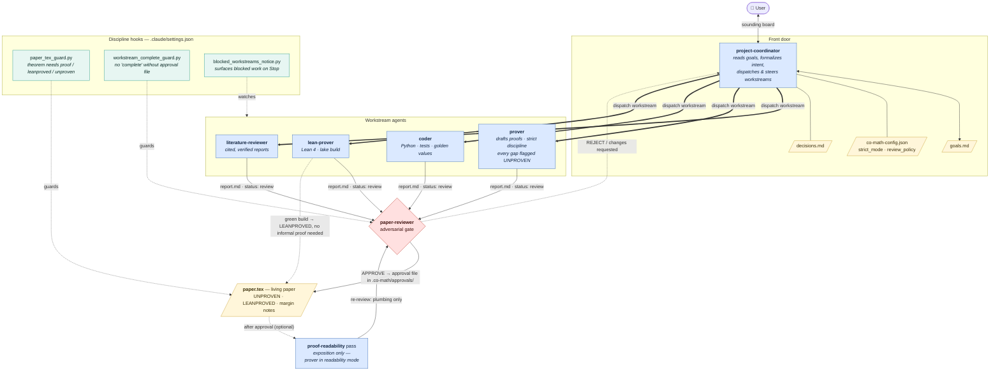
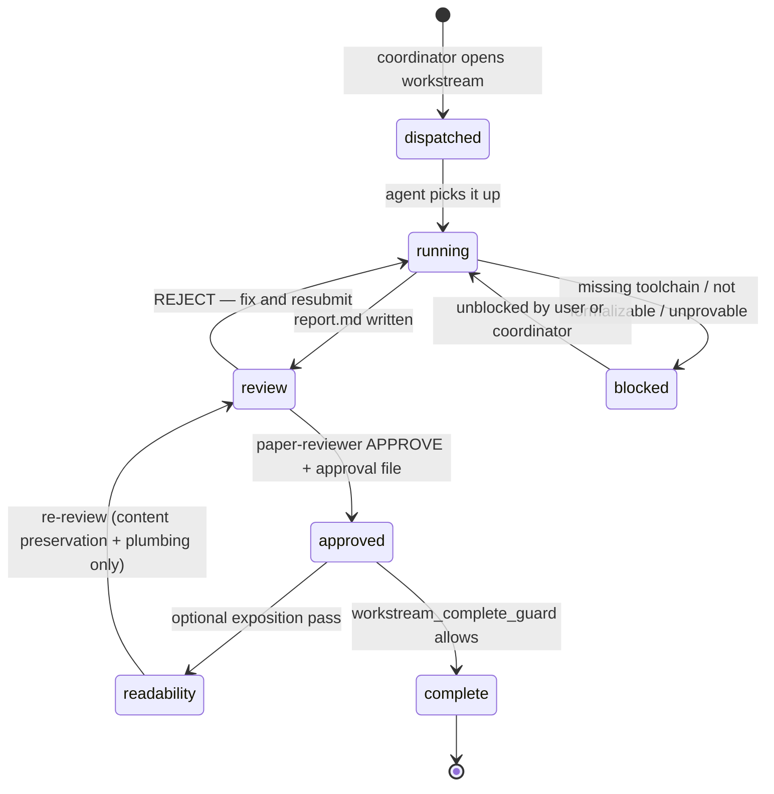
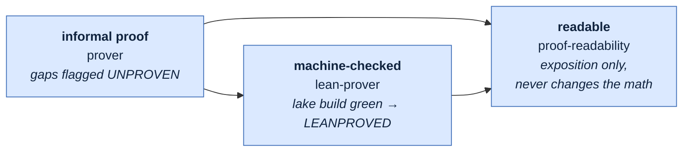

# Co-math architecture & process

The `co-math-init` project runs a small team of Claude Code sub-agents against a
single living paper (`paper.tex`), under hooks that refuse to let work be marked
"complete" without an explicit reviewer approval. The diagrams below render
natively on GitHub (Mermaid). Edit the source blocks to adjust.

Architecture follows Zheng et al. (2026), *AI Co-Mathematician* (Google DeepMind).

---

## 1. System architecture

Who talks to whom, and where the artifacts live.

---

## 2. Workstream lifecycle

Every unit of work is a `workstreams/W{NNN}-{slug}/` directory
(`instructions.md`, `status.md`, `log.md`, `report.md`). Its status moves
through these states — nothing reaches `complete` without a `paper-reviewer`
approval file.

---

## 3. Verification ladder

Three levels of "proven", weakest to strongest — and the exposition pass that
runs after any of them.

A `lean-prover` build that exits 0 with no `sorry` is accepted by
`paper-reviewer` with only plumbing checks — the compiler has verified the
mathematics, so the theorem is closed with `\leanproved{}` instead of an
informal `\proof`. The `proof-readability` pass never alters mathematical
content; a suspected gap routes the workstream back to the `prover` rather than
getting quietly patched.
